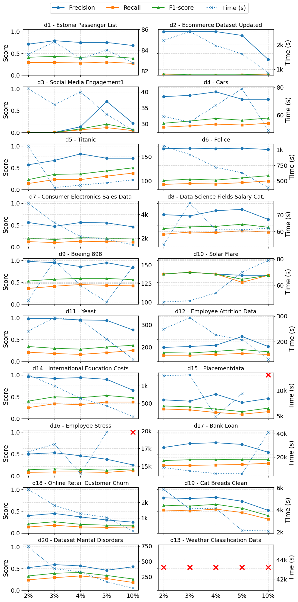
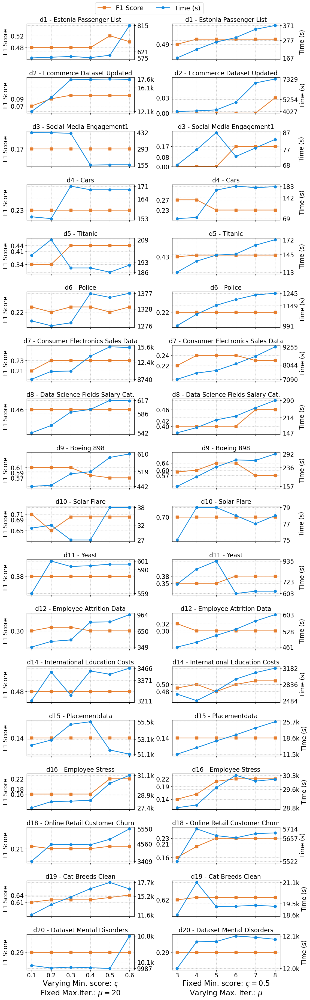

# TRIARD: A ThReshold-tuned strategy combining data Imputation And Rfdc Discovery
Is a research prototype designed to perform **automated data imputation** using **Relaxed Functional Dependencies (RFDcs)**.  
It integrates a **threshold tuning strategy** that iteratively adjusts similarity constraints to improve imputation quality while keeping computational costs manageable.

## ⚙️ Installation

Clone the repository and install the dependencies (Python ≥ 3.10 is recommended):

```bash
git clone https://github.com/DastLab/TRIARD.git
cd TRIARD
pip install -r requirements.txt
```

## Usage
python run.py <dataset_file_path> [options]

### Examples
```bash
python run.py datasets --iterations 7 --min_score_to_reach 0.5
```
```bash
python run.py datasets/d01_estonia-passenger-list.csv --iterations 7 --min_score_to_reach 0.5
```
## Input format

- Dataset: CSV file with ; (semicolon) separator.
- The dataset may include or omit a header row.

## Command-line Arguments

| Argument                                      | Type / Default            | Description                                                                     |
| --------------------------------------------- | ------------------------- | ------------------------------------------------------------------------------- |
| `dataset_file_path`                           | *positional*              | Path to the CSV dataset file or folder.                                         |
| `--remove_log`                                | flag                      | Prevents saving intermediate logs and results.                                  |
| `--dataset_has_not_header`                    | flag                      | Specify if the dataset has **no header row**.                                   |
| `--dataset_null_char`                         | str, default=`?`          | Character used to represent missing values.                                     |
| `--output_folder`                             | str, default=`output`     | Folder where output files and logs will be stored.                              |
| `--increasing_steps`                          | list[int], default=`[]`   | List of threshold increment steps per attribute.                                |
| `--max_similarity_values`                     | list[float], default=`[]` | Maximum similarity values per attribute.                                        |
| `--iterations`                                | int, default=`7`          | Maximum number of tuning iterations per attribute (parameter `μ` in the paper). |
| `--min_score_to_reach`                        | float, default=`0.5`      | Minimum convergence score threshold (parameter `ϛ` in the paper).               |
| `--prevent_use_previous_results_at_each_step` | bool, default=`True`      | Prevents using dependencies from previous iterations.                           |
| `--missing_percentage_generator`              | float, default=`1`        | Percentage of artificially injected missing values for validation.              |
| `--prevent_run_domino`                        | flag                      | Prevents the comparative imputation using the DOMINO algorithm.                 |
| `--time_limit`                                | int, default=`None`       | Time limit for the entire process (in seconds).                                 |

## Output
All generated files and logs are stored in the folder specified by --output_folder.

## Convergence criteria test

```bash
python score_test.py datasets \
  --iterations 1 2 3 4 5 6 7 \
  --min_score_to_reach 0.1 0.2 0.3 0.4 0.5 0.6 
```

This command executes TRIARD on the all CSV in datasets folder, testing all combinations of:

μ ∈ {1, 2, 3, 4, 5, 6, 7}

ϛ ∈ {0.1, 0.2, 0.3, 0.4, 0.5, 0.6}


| Argument                                      | Type / Default                                   | Description                                                               |
| --------------------------------------------- | ------------------------------------------------ | ------------------------------------------------------------------------- |
| `dataset_file_path`                           | *positional*                                     | Path to a CSV dataset file or a folder containing multiple datasets.      |
| `--remove_log`                                | flag                                             | Disable saving of intermediate logs and results.                          |
| `--dataset_has_not_header`                    | flag                                             | Specify if the dataset has **no header row**.                             |
| `--dataset_null_char`                         | str, default=`?`                                 | Character representing missing values.                                    |
| `--output_folder`                             | str, default=`output`                            | Folder for storing all experiment results and logs.                       |
| `--increasing_steps`                          | list[int], default=`[]`                          | Incremental step size for each attribute’s threshold tuning.              |
| `--max_similarity_values`                     | list[float], default=`[]`                        | Maximum similarity value for each attribute.                              |
| `--iterations`                                | list[int], default=`[1,2,3,4,5,6,7]`             | Range of maximum iteration values (μ) to be tested.                       |
| `--min_score_to_reach`                        | list[float], default=`[0.1,0.2,0.3,0.4,0.5,0.6]` | Range of minimum convergence scores (ϛ) to be tested.                     |
| `--prevent_use_previous_results_at_each_step` | bool, default=`False`                            | If `True`, disables reuse of previously found dependencies during tuning. |
| `--missing_percentage_generator`              | float, default=`1`                               | Percentage of missing values artificially injected for evaluation.        |

## Dataset

This repository includes a collection of publicly available datasets used to evaluate TRIARD on heterogeneous (see "all_dataset" folder of this repository), real-world data scenarios with varying levels of incompleteness and attribute semantics.

| ID  | File name                              | Source |
| --- | ----------------------------------------- | ------ |
| d01 | d01_estonia-passenger-list.csv             | https://www.kaggle.com/datasets/christianlillelund/passenger-list-for-the-estonia-ferry-disaster |
| d02 | d02_ecommerce_dataset_updated.csv          | https://www.kaggle.com/datasets/steve1215rogg/e-commerce-dataset |
| d03 | d03_social_media_engagement1.csv           | https://www.kaggle.com/datasets/divyaraj2006/social-media-engagement |
| d04 | d04_cars.csv                               | https://archive.ics.uci.edu/dataset/9/auto+mpg |
| d05 | d05_titanic.csv                            | https://www.kaggle.com/datasets/shubhamgupta012/titanic-dataset |
| d06 | d06_police.csv                             | https://gist.github.com/curran/22d56e255b4c98354569 |
| d07 | d07_consumer_electronics_sales_data.csv    | https://www.kaggle.com/datasets/rabieelkharoua/consumer-electronics-sales-dataset |
| d08 | d08_Data_Science_Fields_Salary_Categorization.csv | https://www.kaggle.com/datasets/whenamancodes/data-science-fields-salary-categorization |
| d09 | d09_Boeing_898.csv                         | https://www.kaggle.com/datasets/nurielreuven/boeing-historical-airplane-orders-deliveries |
| d10 | d10_solar-flare.csv                        | https://archive.ics.uci.edu/dataset/89/solar+flare |
| d11 | d11_yeast.csv                              | https://archive.ics.uci.edu/dataset/110/yeast |
| d12 | d12_employee_attrition_data.csv            | https://www.kaggle.com/datasets/mrsimple07/employee-attrition-data-prediction |
| d13 | d13_weather_classification_data.csv        | https://www.kaggle.com/code/siddharthsehgal/weather-classification |
| d14 | d14_International_Education_Costs.csv      | https://www.kaggle.com/datasets/shujahbutt/international-education-costs |
| d15 | d15_placementdata.csv                     | https://www.kaggle.com/datasets/ruchikakumbhar/placement-prediction-dataset |
| d16 | d16_employee_stress.csv                   | https://www.kaggle.com/datasets/chanchalagorale/employees-stress-level-dataset |
| d17 | d17_bank_loan.csv                         | https://www.kaggle.com/datasets/nasimetemadi/bank-loan |
| d18 | d18_online_retail_customer_churn.csv       | https://www.kaggle.com/datasets/hassaneskikri/online-retail-customer-churn-dataset |
| d19 | d19_cat_breeds_clean.csv                   | https://www.kaggle.com/datasets/joannanplkrk/its-raining-cats |
| d20 | d20_Dataset-Mental-Disorders.csv           | https://www.kaggle.com/datasets/mdsultanulislamovi/mental-disorders-dataset |


## Impact of Missing Rate on TRIARD Performance

This figure reports the behavior of TRIARD under increasing levels of missing value injection. 
For each dataset, Precision, Recall, F1-score, and execution time are measured while progressively varying the missing rate, 
in order to assess the robustness and scalability of the approach with respect to different degrees of data incompleteness.




## Impact of Stopping Criteria on TRIARD Performance

This figure illustrates the behavior of TRIARD under different stopping criteria configurations.
The analysis assesses the impact of the stopping criteria on execution time and final F1-score.

